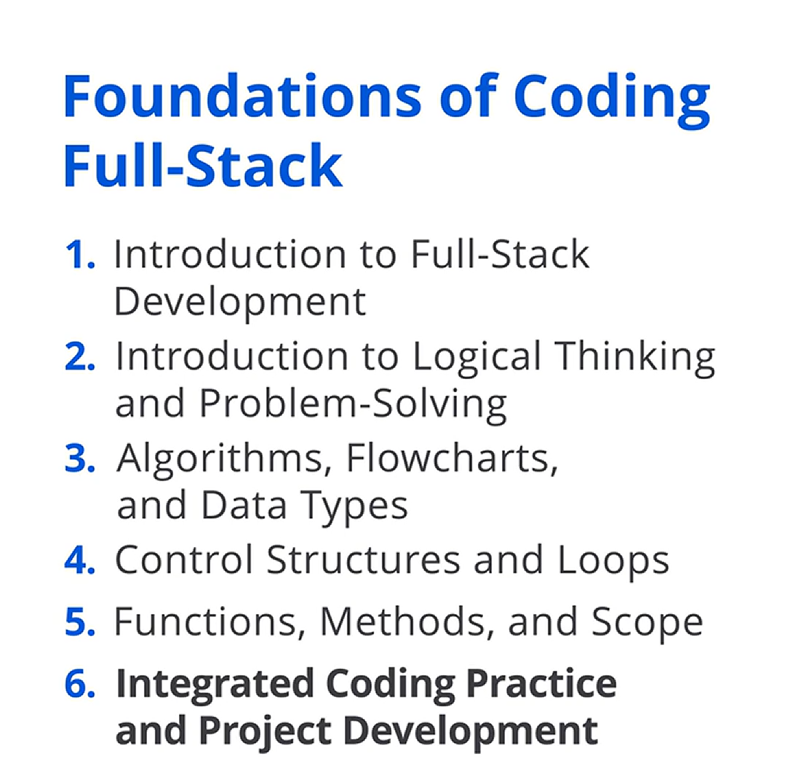

## 📘 Kurs Tanıtımı: Full-Stack Kodlamanın Temelleri

*Foundations of Coding Full-stack* kursuna hoş geldiniz. Burada, dinamik ön yüz arayüzlerinden güçlü arka uç sistemlerine kadar her web uygulaması katmanını oluşturma ve yönetme konusunda ustalaşacaksınız.

API entegrasyonu, sürüm kontrolü ve güvenlik için en iyi uygulamalara derinlemesine dalarak, sağlam ve ölçeklenebilir uygulamalar geliştirmeniz için gereken araçları edineceksiniz. Kursun sonunda, full-stack projeleri hayata geçirmek ve günümüzün teknoloji odaklı dünyasında başarılı olmak için gerekli beceri ve özgüvene sahip olacaksınız.

## 🧩 Full-Stack Geliştirmeyi Anlamak

Full-stack geliştirmeyi inceleyerek başlayacağız ve bunun, sorunsuz uygulamalar oluşturmak için ön yüz ve arka uç uzmanlığını nasıl birleştirdiğini ortaya çıkaracağız.

Full-stack geliştiricilerin benzersiz rolünü ve onları sektörde vazgeçilmez kılan temel araçları ve teknolojileri keşfedeceğiz.

## 🧠 Problem Çözme Becerilerini Güçlendirme

Sonraki adımda, problem çözme becerilerinizi güçlendirecek; zorlukların üstesinden net mantık ve stratejik düşünme ile gelmeyi öğreneceksiniz.

Karmaşık görevleri parçalara ayırmaya ve gerçek dünyada kullanıma hazır verimli kod yazmaya yönelik güçlü teknikleri inceleyeceğiz.

## 🏗️ İstemci-Sunucu Mimarisi ve API’ler

Ardından, istemci-sunucu mimarisini, *HTTP* ile *HTTPS* arasındaki farkları ve *RESTful API’ler* ile *GraphQL* ilkelerini inceleyeceğiz.

Ayrıca, gerçek zamanlı iletişim için *WebSocket* kullanımını ele alarak dinamik uygulama etkileşimlerini geliştireceğiz.

## 🗄️ Veritabanı Temelleri ve Performans

Sonrasında veritabanlarının temellerine geçerek ilişkisel ve ilişkisel olmayan ( *non-relational* ) yapıları inceleyeceğiz.

Veritabanı şemalarını etkili biçimde tasarlamayı ve yönetmeyi öğrenecek; ardından en yüksek verimlilik için veritabanı performansını optimize etmeye yönelik stratejilere odaklanacaksınız.

## 🔀 Sürüm Kontrolü: Git ve GitHub

Devamında sürüm kontrolünün temellerini ele alacak; iş birliği için *Git* ve *GitHub* kullanımını inceleyecek ve gelişmiş *Git* tekniklerine derinlemesine dalacağız.

En iyi uygulamaları kullanarak bir full-stack uygulaması için kavramsal ( *conceptual* ) bir tasarım oluşturacaksınız.

## 🧮 Kodlama Kavramlarını Uygulama ve Proje

Son olarak, kodlama kavramlarını ve problem çözme tekniklerini uygulayacak; algoritmalar ve akış şemaları ( *flow charts* ) oluşturacak, kontrol yapıları ve döngüler kullanacak ve kapsamlı bir kodlama projesine giden yolda modüler kod geliştireceksiniz.

## ✅ Kursun Genel Kazanımları

Bu kurs boyunca, ön yüz arayüzleri oluşturmaktan arka uç sistemlerini yönetmeye kadar full-stack geliştirmenin her yönünde ustalaşacaksınız.

API’leri entegre etmeyi, veritabanlarını optimize etmeyi ve sürüm kontrolü kullanmayı öğrenecek; böylece dinamik ve ölçeklenebilir uygulamalar geliştirmek için donanımlı hâle geleceksiniz.

Sizi yetkin bir full-stack geliştirici olma yolunda yönlendirmekten heyecan duyuyoruz.

