Full-Stack Development

## 🧩 Full-Stack Geliştirme

Çevrim içi öğrenmenin geleceğini şekillendirebilecek bir web sitesi geliştirdiğinizi hayal edin. Bir full-stack geliştirici olarak, yalnızca öğrencilerin etkileşime girdiği kullanıcı arayüzünü oluşturmuyorsunuz. Aynı zamanda onu çalıştıran arka uç süreçlerini de tasarlıyorsunuz.

Full-stack geliştiriciler, bir uygulamanın kullanıcı deneyiminden verilerin perde arkasında nasıl yönetildiğine kadar her yönünü anlama konusunda benzersiz bir yeteneğe sahiptir. Bu videoda full-stack geliştirmeyi tanımlayacak ve izlediği ilkeleri inceleyerek full-stack geliştirmeyi daha ayrıntılı keşfedeceğiz.

Ancak full-stack geliştirmeyi ve ilkelerini incelemeden önce, temeli anlamak için bir an ayıralım: ön yüz ( *front-end* ) ve arka uç ( *back-end* ) geliştirme. Bunlar, full-stack geliştiricilerin zamanlarının büyük kısmını geçirdiği temel alanlardır; o hâlde bunları parçalarına ayıralım.

## 🖥️ Ön Yüz: Kullanıcının Etkileşime Girdiği Katman

Ön yüz, bir tarayıcı, mobil uygulama veya masaüstü uygulama olsun, doğrudan kullanıcının cihazında çalışan uygulama kısmıdır.

Kullanıcının uygulamayla etkileşime girdiği yerdir. Bu etkileşim; deneyimledikleri ve tıkladıkları her şeyi, yerleşimi, metni, görselleri, butonları ve formları kapsar.

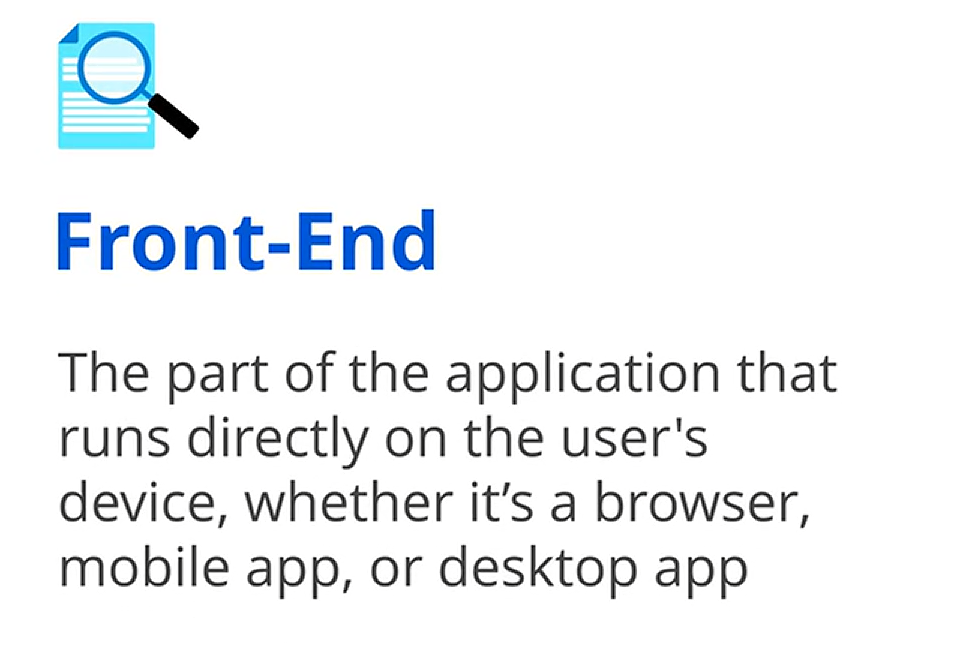

## 🛠️ Arka Uç: Sunucuda Çalışan “Perde Arkası”

Öte yandan arka uç, sunucuda çalışan uygulama kısmıdır. Perde arkasındaki sihrin gerçekleştiği yer burasıdır: veritabanlarını yönetir, istekleri işler ve her şeyin sorunsuz çalışmasını sağlar.

Örneğin, bir web sitesinde bir form gönderdiğinizde, arka uç girdinizi işler ve ön yüzde görüntülenmesi için gerekli veriyi sunucudan alır.

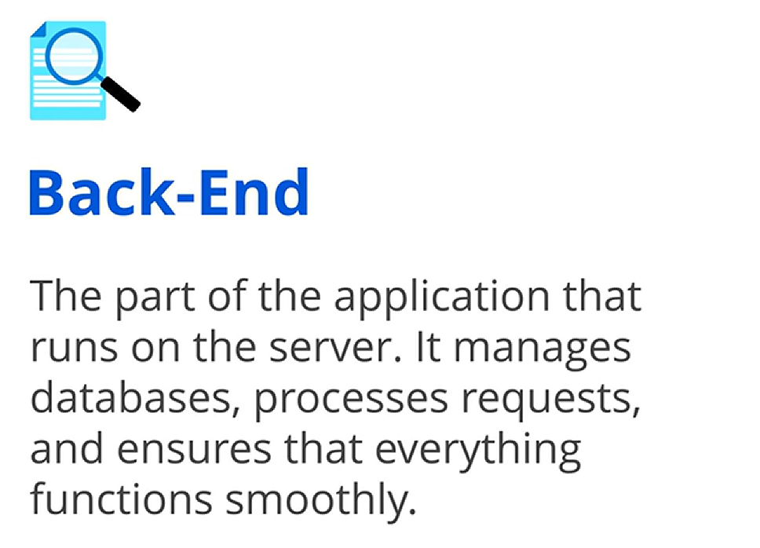

## 🔗 Full-Stack Entegrasyonu: Ön Yüz ve Arka Ucu Birleştirmek

Ön yüz ve arka ucu tanımlayarak temeli attığımıza göre, full-stack geliştiricilerin bu alanları nasıl entegre ettiğini inceleyebiliriz.

Bu entegrasyon, full-stack geliştiricilerin tüm uygulamayı denetlemesine ve optimize etmesine olanak tanır; böylece kullanıcıya dönük öğeler ve alttaki süreçler uyum içinde çalışır.

## 🧠 Full-Stack Geliştirme Tanımı

Full-stack geliştirme, bir web uygulamasının hem ön yüzünün hem de arka yüzünün geliştirilmesidir.

Bu rol, kullanılan teknolojilerin geniş kapsamlı anlaşılmasını ve kesintisiz bir kullanıcı deneyimi sunmak için bu teknolojilerin birlikte nasıl çalışacağını bilmeyi gerektirir. Örneğin, bir full-stack geliştirici bir web sitesinin arayüzünü tasarlarken aynı zamanda işlevselliğini sağlayan sunucu tarafı kodu da yazabilir.

Uygulamanın her iki tarafında da ustalaşarak, full-stack geliştiriciler sistemin tüm parçalarının birlikte çalışmasını sağlar ve pürüzsüz, verimli bir kullanıcı deneyimi sunar.

## 📌 Full-Stack İlkeleri

Full-stack geliştirmeyi anlamak, kapsamına dair bir bakış sağlar. Şimdi, full-stack geliştiricileri hem ön yüz hem de arka uç süreçlerini etkili şekilde yönetme konusunda güçlendiren ilkeleri inceleyeceğiz.

Bu ilkeler, ön yüz arayüzlerinden arka uç süreçlerine kadar tüm öğelerin, bütüncül bir kullanıcı deneyimi sunmak için sorunsuz biçimde entegre olmasını sağlar.

Full-stack geliştiriciler; hem ön yüz hem de arka uçta ustalaşmalı, uçtan uca çözümler sunmalı, performansı optimize etmeli, güvenliği önceliklendirmeli, erişilebilirliği sağlamalı ve duyarlı ( *responsive* ) tasarımı benimsemelidir.

Şimdi bu ilkelerin her birini ayrıntılı biçimde ele alacağız; hem ön yüz hem de arka uçta ustalaşmayla başlayarak.

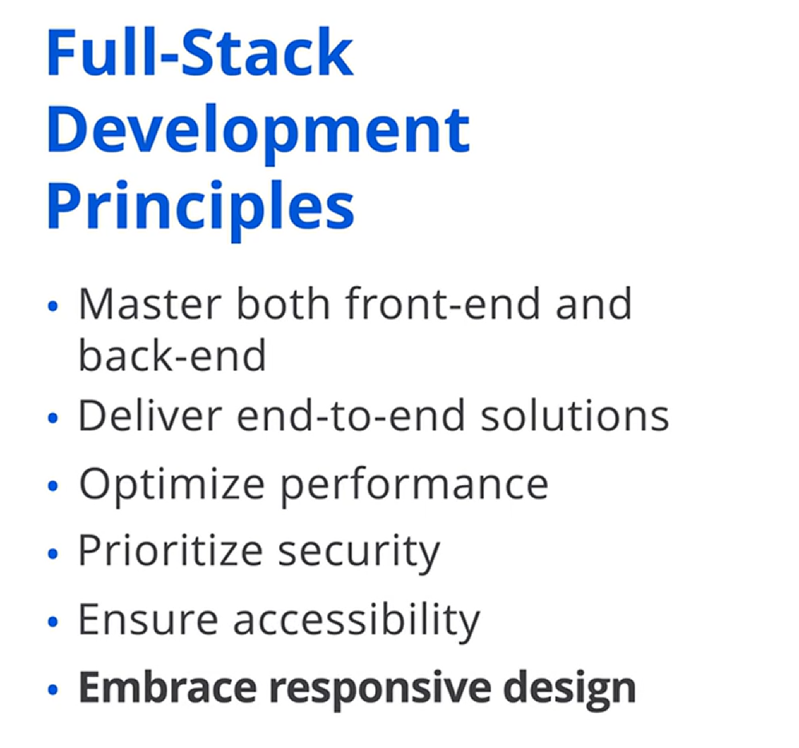

---

## 🧩 Ön Yüz ve Arka Uçta Ustalaşmak

Full-stack geliştiricilerin etkili olabilmesi için hem ön yüz hem de arka uçta ustalaşması gerekir.

Bu, sezgisel bir deneyim oluşturmak için  *HTML* , *CSS* ve *JavaScript* gibi teknolojilerle kullanıcı arayüzleri inşa edebilme becerisini içerir. Aynı zamanda  *C#* , *Python* veya *Ruby* gibi araçlarla veritabanı yönetimi ve API entegrasyonu gibi sunucu tarafı görevleri ele alabilmeyi de kapsar.

Hem ön yüz hem de arka uçta ustalaşmak, full-stack geliştiricileri uçtan uca çözümler sunmak için gerekli becerilerle donatır.

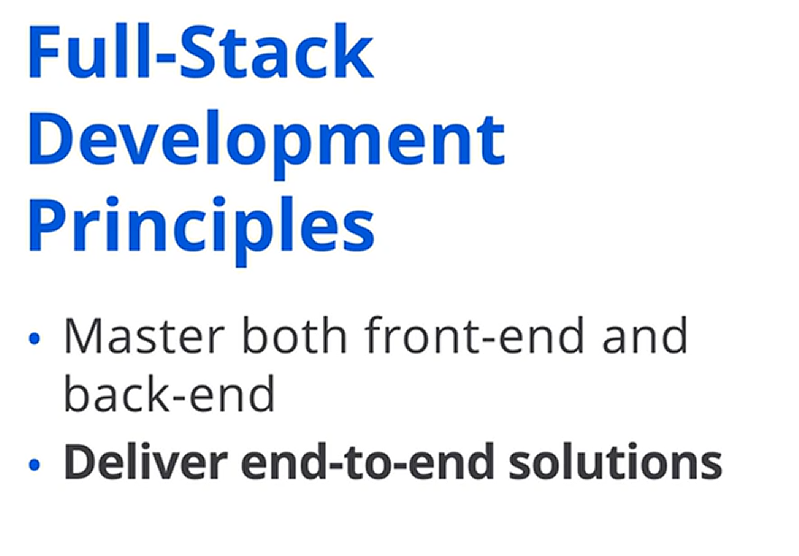

## 🔄 Uçtan Uca Çözümler Sunmak

Full-stack geliştirme, kullanıcı arayüzü ile sunucu arasında akıcı etkileşimler oluşturmayı önceliklendirir. Bu, verinin ön yüzden arka uca ve tekrar kullanıcıya sorunsuz biçimde akmasını sağlamak demektir.

Örneğin, bir full-stack geliştirici, kullanıcının kredi kartı bilgilerini girdiğinde bu verinin doğru şekilde ve hızlıca işlenmesine, ardından kullanıcının hemen bir onay mesajı almasına odaklanabilir.

## ⚡ Performansı Optimize Etmek

Uçtan uca çözümler sunmak, full-stack geliştiricilerin performansı optimize etmesini gerektirir.

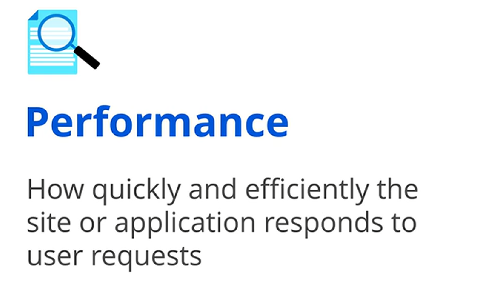

Kullanıcı arayüzünden arka uç veritabanına kadar her katmanı ince ayar ( *fine tuning* ) yaparak, uygulamanın verimli çalışmasını sağlarlar; kullanıcılara hızlı ve duyarlı bir deneyim sunarlar.

Performans, sitenin veya uygulamanın kullanıcı isteklerine ne kadar hızlı ve verimli yanıt verdiğini ifade eder. Örneğin, bir web sitesinde bir butona tıkladığınızda, yüksek performans sayfanın anında yüklenmesini sağlayarak akıcı bir deneyim sunar.

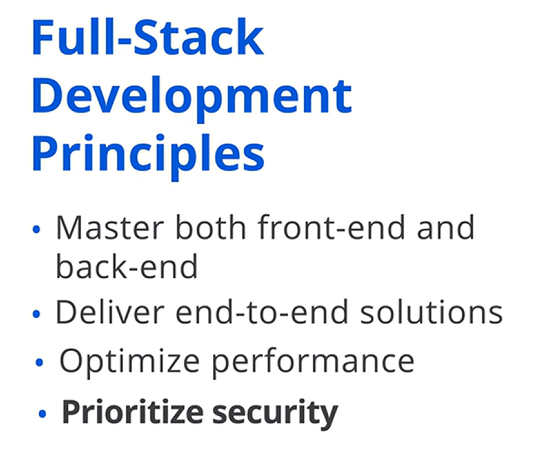

## 🔐 Güvenliği Önceliklendirmek

Full-stack geliştiriciler sistemi hız için ince ayar yaparken, tehditlere karşı korunmak için her katmana güçlü güvenlik önlemleri de yerleştirmelidir.

Bu, uygulamanın güvenli ve güvenilir kalmasını sağlar.

Güvenlik, geliştiricilerin web sitelerini ve uygulamaları yetkisiz erişim, veri ihlalleri ve diğer siber tehditlerden korumak için uyguladığı önlemler ve protokolleri ifade eder. Bir full-stack mühendisi olarak, uygulamanızın her katmanının; veritabanından kullanıcı arayüzüne kadar olası tehditlere karşı korunmasını sağlamalısınız.

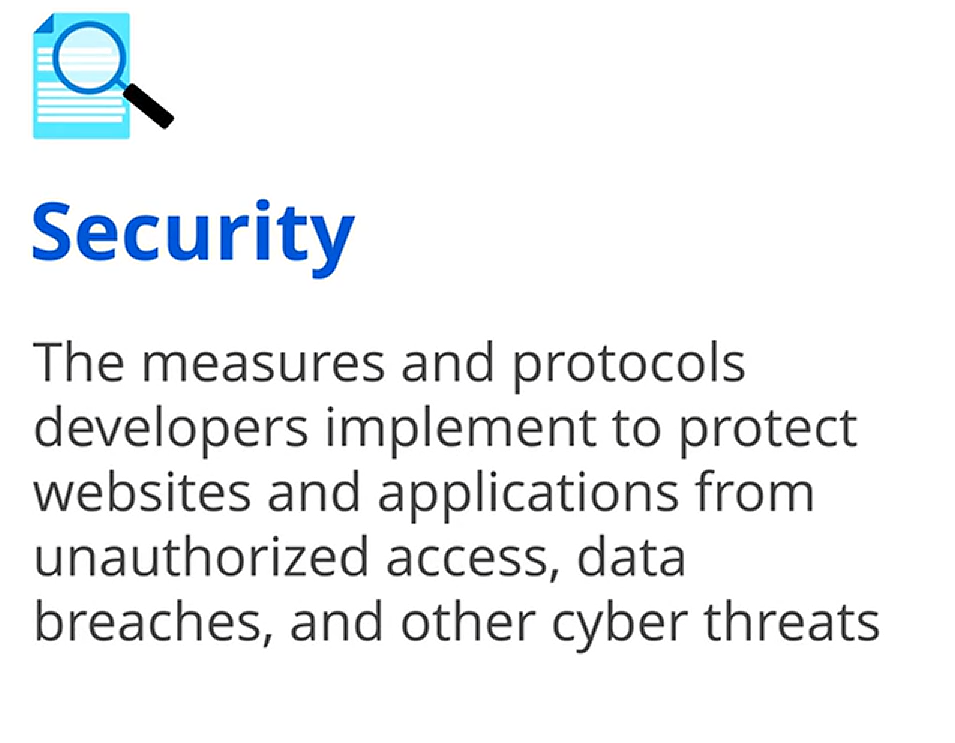

## ♿ Erişilebilirliği Sağlamak

Güvenlik uygulamayı korurken, erişilebilirliği sağlamak uygulamanın erişimini genişletir. Full-stack geliştiriciler kapsayıcılığı ( *inclusivity* ) gözeterek tasarım yapmalı; güvenli ve yüksek performanslı uygulamalarının herkes tarafından kullanılabilir olduğundan emin olmalıdır.

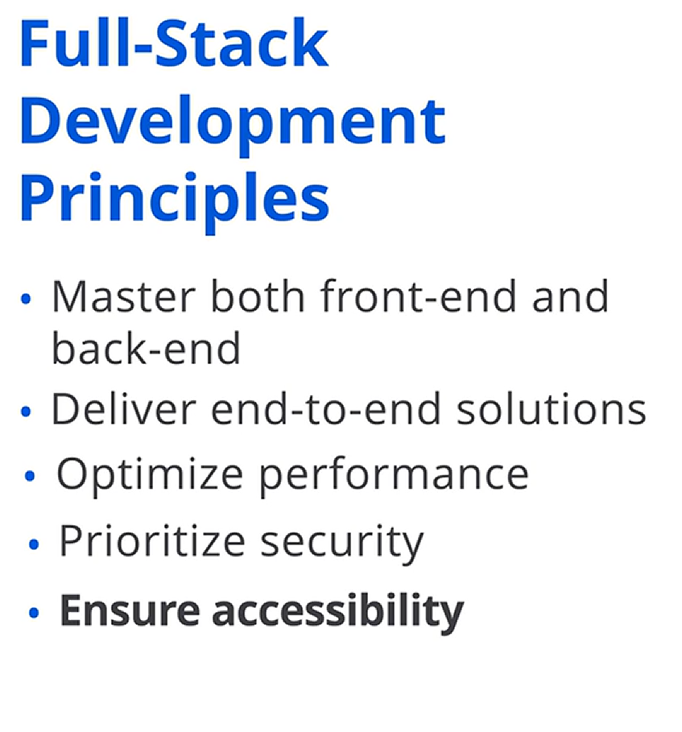

Erişilebilirlik, web sitelerinin ve uygulamaların, yeteneklerinden bağımsız olarak herkes tarafından ve farklı cihazlarda kullanılabilir olmasını sağlar. Full-stack geliştiriciler, engelli bireyler dahil herkesin kolayca gezinebileceği ve anlayabileceği arayüzler oluşturarak web sitelerini ve uygulamaları erişilebilir hâle getirir.

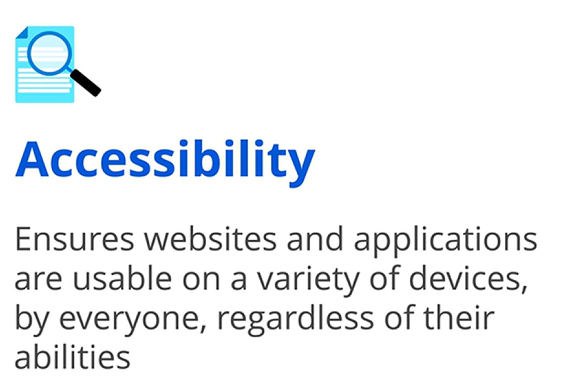

## 📱 Duyarlı Tasarımı Benimsemek

Erişilebilirlik ilkesinin üzerine inşa ederek, uygulamaların farklı cihazlara sorunsuz biçimde uyum sağlaması için duyarlı tasarım ( *responsive design* ) esastır.

Duyarlı tasarımı benimseyerek, full-stack geliştiriciler ekran boyutu ya da yönü ne olursa olsun uygulamalarını esnek ve kullanıcı dostu hâle getirir.

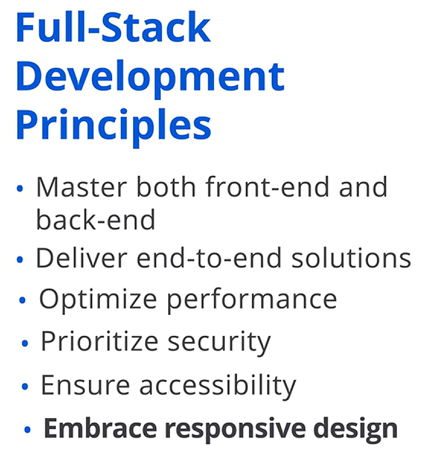

Duyarlılık ( *responsiveness* ), bir web sitesinin yerleşimini ve içeriğini farklı ekran boyutlarına ve yönelimlerine uyacak şekilde değiştirebilme yeteneğini ifade eder. Duyarlılık, masaüstü, dizüstü, tablet veya akıllı telefon gibi herhangi bir cihazda kullanıcıların kolay gezinebilir bir deneyim yaşamasını sağlar.

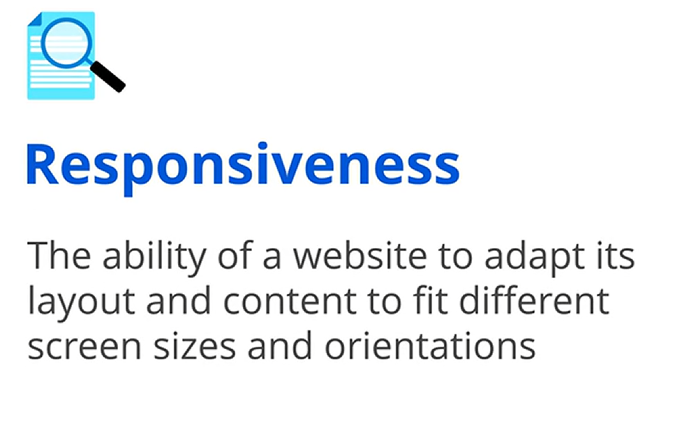

## ✅ Kapanış

Bu videoda full-stack geliştirmeyi tanımladık ve ilkelerini ele aldık. Hem ön yüz hem de arka uç geliştirmeyi anlayarak ve bu temel ilkeleri uygulayarak, full-stack geliştiriciler kullanıcıların farklı ihtiyaçlarını karşılayan bütüncül, yüksek performanslı ve kapsayıcı web uygulamaları oluşturabilir.
