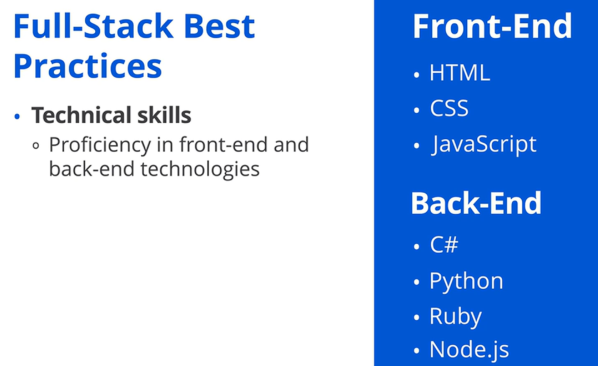
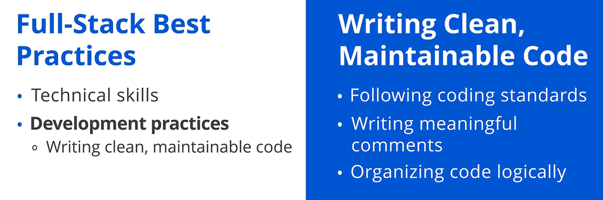
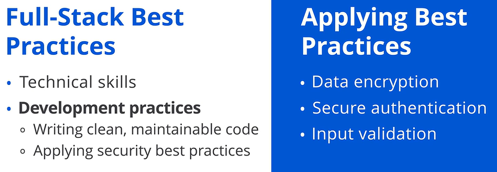
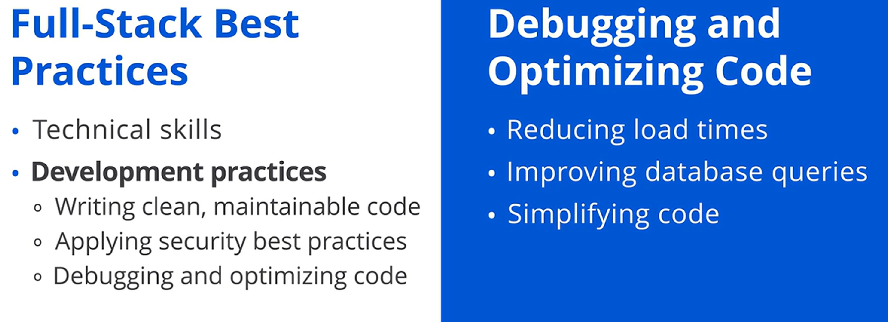
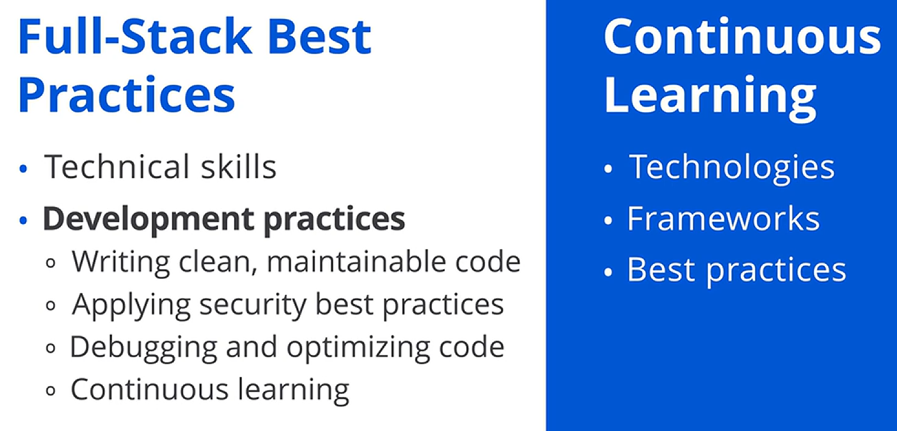

## ✅ Full-Stack Geliştirmede En İyi Uygulamalar

Küçük bir girişimde çalıştığınızı ve görevinizin, insanların teknolojiyi kullanma biçimini değiştirebilecek bir web uygulaması geliştirmek olduğunu hayal edin. Akıcı ve kullanıcı dostu bir ön yüz oluşturmanız ve arka ucun saniyede binlerce işlemi sorunsuz biçimde yönetebildiğinden emin olmanız gerekir.

Bu hızlı tempolu ortamda, full-stack geliştirmede ustalaşmak; rekabetçi bir teknoloji pazarında başarılı olabilecek bir ürün sunmayı mümkün kılar. Bu videoda, full-stack geliştirmenin en iyi uygulamalarını açıklayacağız.

Full-stack geliştirme, bir web uygulamasının hem ön yüzünün hem de arka yüzünün geliştirilmesidir. Verimli ve etkili web uygulamaları oluşturmak için full-stack geliştiriciler en iyi uygulamaları izler. Bu en iyi uygulamalar iki ana kategoride toplanabilir: teknik beceriler ve geliştirme uygulamaları.

## 🧰 Teknik Beceriler

Önce, her full-stack geliştiricinin ihtiyaç duyduğu teknik becerileri inceleyeceğiz. Teknik beceriler; ön yüz ve arka uç teknolojilerinde yetkinliği, sürüm kontrol sistemlerine aşinalığı ve veritabanı yönetimi bilgisini içerir. Şimdi bunların her birini daha ayrıntılı inceleyelim.

## 🖥️ Ön Yüz ve 🛠️ Arka Uç Teknolojilerinde Yetkinlik

İlk olarak, full-stack geliştiricilerin hem ön yüz hem de arka uç teknolojilerinde yetkin olması gerekir. Yetkin olmak, bu teknolojilere yalnızca aşina olmak değil; onlarla her gün çalışırken becerikli ve rahat olmak anlamına gelir.

Ön yüz teknolojileri  *HTML* , *CSS* ve  *JavaScript* ’i içerir. Bu teknolojiler, web’in yapı taşlarıdır ve ilgi çekici kullanıcı arayüzleri oluşturmanızı sağlar.

Arka uç tarafında ise  *C#* ,  *Python* , *Ruby* veya *Node.js* gibi sunucu tarafı diller söz konusudur. Bu dillerde ustalaşmak, tüm uygulamayı destekleyen sağlam sunucu mantığı ( *server logic* ) geliştirmenizi sağlar. Unutmayın, bunların hepsini bilmeniz gerekmez.

## 🔀 Sürüm Kontrol Sistemleri

Sonra, sürüm kontrol sistemlerine odaklanalım. Bir ekip projesinde çalıştığınızı ve aniden kodunuzun daha önceki bir sürümüne geri dönmeniz gerektiğini hayal edin. *Git* gibi sürüm kontrol sistemleriyle bu işlem basit ve verimlidir; sizi saatler sürebilecek olası yeniden çalışma ( *rework* ) yükünden kurtarır.

Sürüm kontrol sistemleri, geliştiricilerin kodlarındaki değişiklikleri takip etmesine ve yönetmesine yardımcı olan araçlardır. Bu sistemler, birden fazla geliştiricinin aynı kod tabanı ( *code base* ) üzerinde eş zamanlı çalışmasına, çakışma ( *conflicts* ) yaşamadan olanak tanır.

## 🗄️ Veritabanı Yönetimi Bilgisi

Bir diğer kritik teknik beceri, veritabanı yönetimi bilgisidir. Veritabanı yönetimi; verileri kolay erişilebilir, yönetilebilir ve güncellenebilir biçimde organize etmeyi ve saklamayı içerir.

*MySQL* gibi *SQL* veritabanlarına olduğu kadar *MongoDB* gibi *NoSQL* veritabanlarına da aşina olmalısınız. Doğru veritabanı yönetimi, uygulamanızın veriyi verimli ve güvenli şekilde depolamasını ve geri almasını sağlar.

## 🧭 Geliştirme Uygulamaları

Güçlü bir teknik temel oluşturduktan sonra, şimdi güvenli, sürdürülebilir ( *maintainable* ) ve verimli uygulamalar geliştirmenize yardımcı olacak geliştirme uygulamalarını inceleyelim.

Bunlar; temiz ve sürdürülebilir kod yazmayı, güvenlik için en iyi uygulamaları uygulamayı, kodu hata ayıklamayı ve optimize etmeyi ve sürekli öğrenmeyi ( *continuous learning* ) içerir. Şimdi her birini daha derinlemesine inceleyelim.

## 🧹 Temiz ve Sürdürülebilir Kod Yazmak

Öncelikle, temiz ve sürdürülebilir kod yazmak kritik öneme sahiptir. Temiz kod, okunması, anlaşılması ve değiştirilmesi kolay olan kodu ifade eder; sürdürülebilir kod ise başkaları tarafından kolayca güncellenebilen veya genişletilebilen koddur.

Full-stack geliştiricilerin temiz ve sürdürülebilir kod yazması; kodlama standartlarını izlemeyi, anlamlı yorumlar ( *meaningful comments* ) yazmayı ve kodu mantıklı şekilde organize etmeyi gerektirir.

Temiz kod, hataları ( *bugs* ) azaltır ve ekiplerin birlikte çalışmasını kolaylaştırarak uzun vadeli başarıyı garanti eder.

## 🔐 Güvenlik için En İyi Uygulamaları Uygulamak

Sonraki olarak, güvenlik için en iyi uygulamaları uygulamaya odaklanalım. Güvenlik en iyi uygulamaları, yazılımı ve veriyi yetkisiz erişimden, ihlallerden ( *breaches* ) veya diğer tehditlerden korumaya yardımcı olan yönergelerdir.

Bir full-stack geliştirici olarak bu, uygulamalarınızı tehditlerden korumak için veri şifreleme ( *data encryption* ), güvenli kimlik doğrulama ( *secure authentication* ) ve girdi doğrulama ( *input validation* ) uygulamak anlamına gelir.

## 🐞 Hata Ayıklama ve ⚡ Optimizasyon

Şimdi, kodu hata ayıklama ve optimize etmeyi konuşalım. Hata ayıklama, kod içindeki hataları belirlemeye ve düzeltmeye odaklanır; optimizasyon ise kodun verimliliğini ve performansını artırır.

Bu; yükleme sürelerini azaltmayı, veritabanı sorgularını iyileştirmeyi ve kodu sadeleştirmeyi içerir. Verimli kod, daha iyi performansa yol açar; bu da kullanıcı deneyimi için kritiktir.

## 📚 Sürekli Öğrenme

Son olarak, sürekli öğrenmeden bahsedelim. Sürekli öğrenme, yeni beceriler ve bilgi geliştirme sürecinin devamlı olmasını ifade eder.

Hızlı tempolu teknoloji endüstrisinde, en yeni araçlar ve trendlerle güncel kalmak kariyer gelişimi için gereklidir. Bir full-stack geliştirici olarak rekabetçi kalmak için her zaman yeni teknolojileri, çatıları ( *frameworks* ) ve en iyi uygulamaları keşfetmelisiniz.

Sürekli öğrenmeye katılmak, alandaki değişimlere ve gelişmelere uyum sağlamanıza yardımcı olur ve etkin bir geliştirici olarak kalmanızı garanti eder.

## ✅ Kapanış

Bu videoda, full-stack geliştirmenin en iyi uygulamalarını inceledik. Ön yüz ve arka uç teknolojilerinde yetkinliğin, temiz ve sürdürülebilir kod yazmanın, sürüm kontrol sistemlerine aşinalığın, veritabanı yönetimi bilgisinin, güvenlik en iyi uygulamalarını uygulamanın, kodu hata ayıklama ve optimize etmenin ve sürekli öğrenmenin önemini konuştuk.

Bu en iyi uygulamalarda ustalaşarak, full-stack geliştirmenin zorluklarının üstesinden gelmek için iyi şekilde donanımlı olacaksınız.
