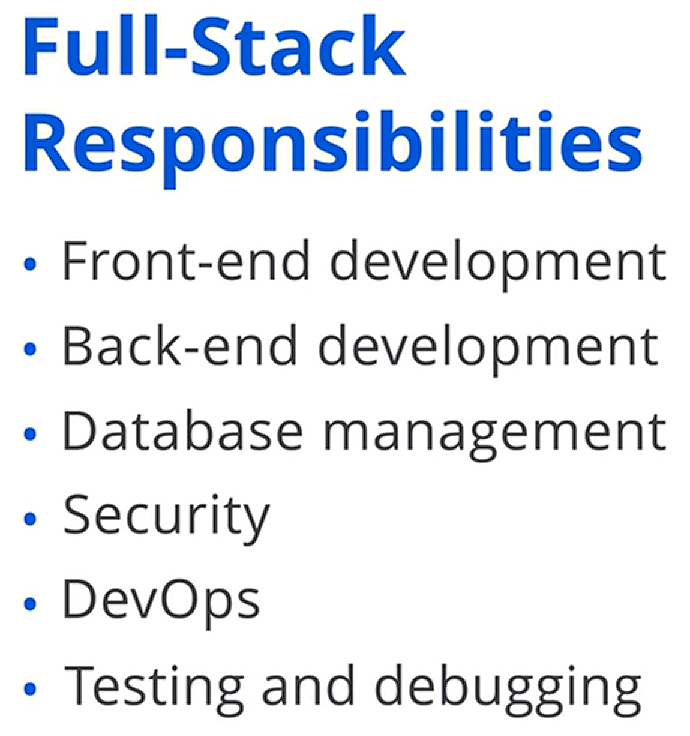
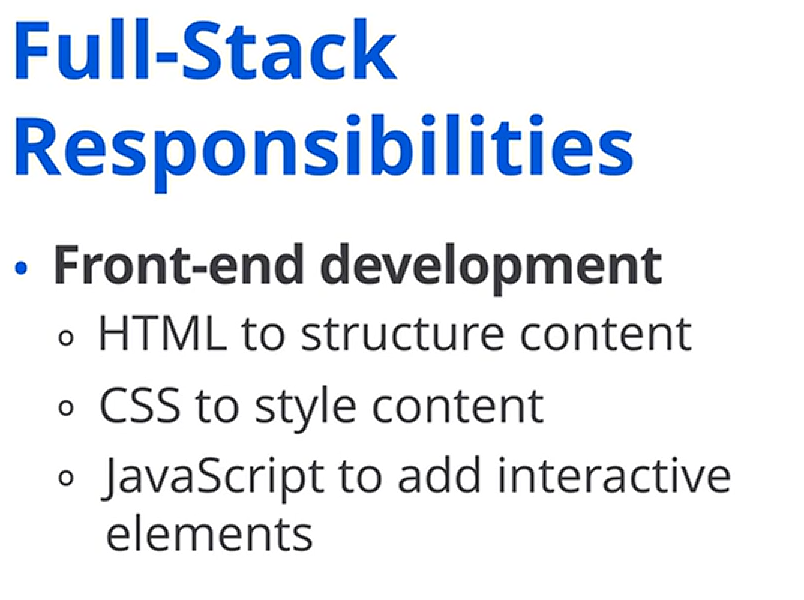
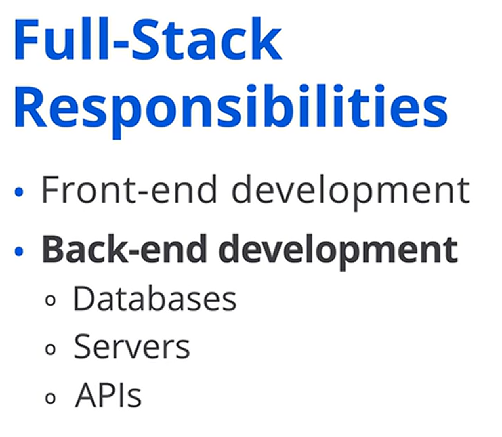
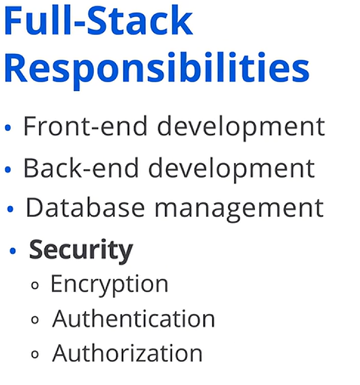
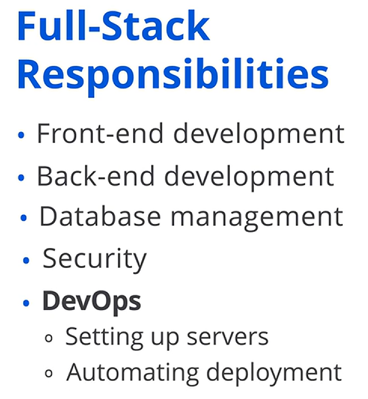
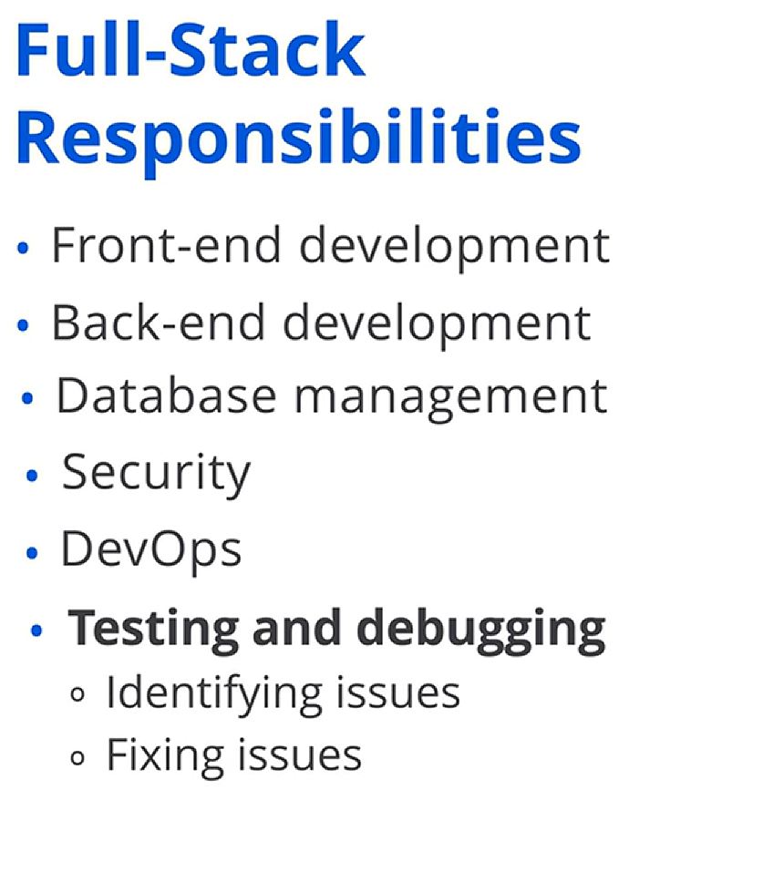

## 🧩 Temel Roller ve Sorumluluklar

Herkesin uzmanlaşmış bir role sahip olduğu bir ekipte çalıştığınızı hayal edin; bazıları görsellere, bazıları ise perde arkasındaki mantığa odaklanır. Peki tüm bu parçaların bir araya uyumla oturmasını kim sağlar? İşte burada full-stack geliştirici devreye girer.

Bir full-stack geliştiricinin rolü, günümüz teknoloji endüstrisindeki en çok yönlü ve en kritik rollerden biridir. Full-stack geliştiriciler, ön yüz ( *front-end* ) ve arka uç ( *back-end* ) geliştirmeyi bir araya getiren; uygulamaların hem görsel olarak çekici hem de işlevsel olarak sağlam olmasını sağlayan yetkin profesyonellerdir.

Bu videoda, full-stack geliştiricilerin sektördeki temel rollerini belirleyeceğiz. Ayrıca full-stack geliştiricilerin sahip olduğu sorumlulukları inceleyerek bu rolü daha ayrıntılı ele alacağız.

## 🌉 Birincil Rol: Ön Yüz ile Arka Uç Arasındaki Köprü

Full-stack geliştiricilerin dünyasını daha derinlemesine keşfederken, birincil rolleriyle başlayalım.

Bir full-stack geliştiricinin birincil rolü, ön yüz ve arka uç geliştirme arasındaki boşluğu kapatmaktır. Her iki tarafı da anlarlar ve bir uygulamanın tüm bileşenlerinin birlikte çalışmasını sağlarlar.

## 🧰 Sorumluluklar: Teknoloji Yığınının Farklı Katmanlarında Çalışmak

Bir full-stack geliştiricinin birincil rolünü anladığınıza göre, bu rolü yerine getirmelerini sağlayan özel sorumlulukları inceleyelim.

Full-stack geliştiriciler, bir uygulamanın sorunsuz çalışmasını sağlamak için teknoloji yığınının ( *technology stack* ) farklı bölümlerinde çalışmayı içeren birkaç temel sorumluluk üstlenebilir. Bu sorumluluklar; ön yüz geliştirme, arka uç geliştirme, veritabanı yönetimi, güvenlik, DevOps ve test ile hata ayıklama veya koddaki sorunları onarmayı içerir.

Şimdi bu sorumlulukların her birini, ön yüz geliştirmeden başlayarak daha ayrıntılı inceleyelim.

---

## 🖥️ Ön Yüz Geliştirme

İyi hazırlanmış bir kullanıcı arayüzü, herhangi bir uygulama için kritik öneme sahiptir ve full-stack geliştiriciler bu zorluğu ön yüz geliştirmeden sorumlu olarak üstlenir.

Ön yüz geliştirme, bir veya daha fazla uygulamanın kullanıcı arayüzünü oluşturmayı ve sürdürmeyi içerir. Bu rolde geliştiriciler, bir web sitesinin veya uygulamanın tasarımlarını ve işlevselliklerini şu dilleri kullanarak uygular:

* Web sayfasının içeriğini yapılandırmak için *HyperText Markup Language* (HTML)
* Bu içeriği görsel olarak çekici hâle getirmek için *Cascading Style Sheets* (CSS)
* Form doğrulama ( *form validation* ) veya dinamik içerik yükleme ( *dynamic content loading* ) gibi etkileşimli öğeler eklemek için *JavaScript*

Örneğin, full-stack geliştiriciler hem mobil cihazlarda hem de masaüstünde iyi çalışan duyarlı ( *responsive* ) bir gezinme çubuğu ( *navigation bar* ) oluşturabilir.

## 🛠️ Arka Uç Geliştirme

Sorunsuz bir kullanıcı arayüzü önemli olsa da, ön yüz işlevselliğinin temelini sağlayan arka uç sistemleridir.

Full-stack geliştiricilerin bu iki tarafın birlikte çalışmasını nasıl sağladığını inceleyelim. Bu noktada, uygulamayı güçlendiren sunucu tarafı altyapısına odaklanan arka uç geliştirme sorumluluğu devreye girer.

Bu rolde, veritabanlarını, sunucuları ve API’leri yöneterek arka ucun ön yüzle etkili biçimde iletişim kurmasını sağlarlar. Örneğin, ön yüzün veritabanından kullanıcı verisini almasına olanak tanıyan bir API kurarak arka ucun sorunsuz çalışmasını sağlamak.

## 🗄️ Veritabanı Yönetimi

Full-stack geliştiriciler, uygulamanın verilerini de yönetmek zorundadır. Bu, bir diğer kritik sorumluluk olan veritabanı yönetimine götürür; burada full-stack geliştiriciler uygulamanın verilerini saklayan veritabanlarını tasarlar ve yönetir.

Verinin güvenli şekilde saklanmasını ve uygulama tarafından verimli biçimde geri alınabilmesini sağlarlar. Örneğin, kullanıcı bilgilerini güvenli biçimde saklayan bir veritabanı tasarlamak ve kullanıcı kimlik doğrulaması için gerektiğinde bu veriyi geri almak.

## 🔐 Güvenlik

Veri hazır olduğunda, bir sonraki kritik odak tüm sistemi korumaktır. Güvenlik hayati hâle gelir ve full-stack geliştiriciler, veriyi koruma ve kullanıcı güvenini sürdürme sorumluluğunu üstlenir.

Bu rolde, uygulamayı korumak için şifreleme ( *encryption* ), güvenli kimlik doğrulama ( *secure authentication* ) ve yetkilendirme ( *authorization* ) gibi güvenlik önlemleri uygularlar. Örneğin, kullanıcı kimlik doğrulaması kurmak ve yetkisiz erişimi önlemek için hassas kullanıcı verilerini şifrelemek.

## 🚀 DevOps ve Dağıtım

Güvenlik kontrol altına alındığında, bir sonraki büyük zorluk uygulamayı dağıtım ( *deployment* ) yoluyla hayata geçirmektir.

Burada full-stack geliştiriciler, uygulamaların üretim ortamlarına ( *production environments* ) dağıtımını ele aldıkları DevOps sorumluluklarını üstlenebilir. Bu, bir sunucuya uygulama dağıtımlarını otomatikleştirmek için *CI/CD pipelines* kurmayı içerir.

Örneğin, bir uygulamayı konteynerleştirmek ( *containerize* ) için *Docker* kullanmak ve onu bir bulut sunucusuna dağıtmak.

## 🧪 Test, Hata Ayıklama ve Onarım

Dağıtımdan sonra bile iş bitmiş sayılmaz. Uygulamaların kusursuz çalışmasını sağlamak için sürekli test ve hata ayıklama gereklidir.

Full-stack geliştiriciler, problem çözücü olarak hem ön yüz hem de arka uç genelinde sorunları belirleme ve düzeltme görevini üstlenir. Örneğin, arka uç mantığındaki bir hatadan dolayı bir ön yüz özelliğinin doğru görüntülenmemesi sorununu ayıklamak.

---

## ✅ Kapanış

Her sorumluluk, full-stack geliştiricilerin ön yüz ve arka uç geliştirmeyi bağlayan birincil rollerini yerine getirmesine yardımcı olmak için bir sonrakinin üzerine inşa edilir.

Bu videoda, full-stack geliştiricilerin sektördeki temel rolleri ve sorumlulukları hakkında bilgi edindiniz. Hem ön yüz hem de arka uç görevlerinde çalışabilme yetenekleri, uygulamaların sorunsuz entegrasyonunu ve işlevselliğini sağlamada onları vazgeçilmez kılar.

Bu rolü ve sorumluluklarını anlamak, teknoloji dünyasında full-stack geliştiricilerin çok yönlülüğünü ve önemini takdir etmenize yardımcı olabilir.
