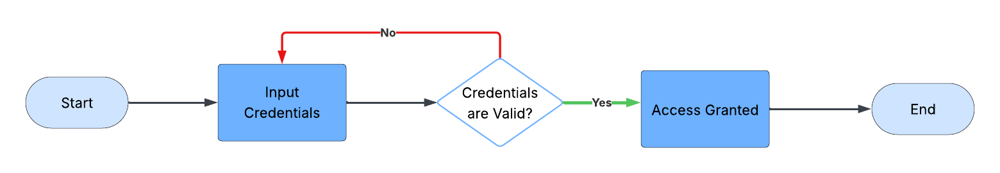
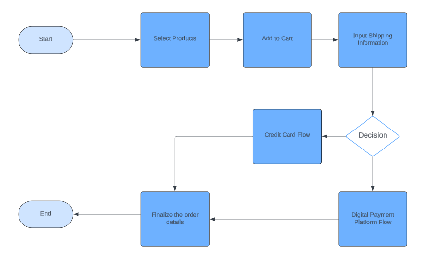

## 🧠 Programlamada Mantıksal Süreçleri Uygulama

### 🎯 Amaç

Yazılım geliştiricilerin, kod yazmadan önce programın mantıksal akışını planlamak ve görselleştirmek için akış şemaları ve *pseudocode* kullanabilmesini göstermek.

---

## 📝 Açıklama

Bu etkinlik,  *sıralamalar (sequences)* , *kontrol yapıları (control structures)* ve *yinelemeler (iterations)* gibi mantıksal süreçlerin akış şemaları ve *pseudocode* ile nasıl haritalanabileceğine dair örnekler sunacaktır. Bu süreçleri görselleştirerek, kodunuzun mantıklı ve verimli bir yol izlemesini sağlayabilirsiniz.

---

## 🔐 Örnek 1: Giriş Sistemi Akış Şeması ve Pseudocode Oluşturma

### ✅ Adım Adım Örnek

#### 1. Problemi Tanımlayın

Kullanıcıların kullanıcı adı ve parola girebileceği bir giriş sistemi oluşturun. Sistem bu kimlik bilgilerini doğrulamalı ve erişime izin vermeli ya da erişimi reddetmelidir.

---

#### 2. Temel Süreçleri Belirleyin

* Kullanıcı adı ve parola girişi
* Kimlik bilgilerini doğrulama
* Doğrulamaya göre erişim verme veya reddetme

---

#### 3. Akış Şemasını Çizin

* **Start (Oval):** Giriş sürecinin başlangıcını temsil eder.
* **Input Credentials (Rectangle):** Kullanıcı kullanıcı adını ve parolasını girer.
* **Validate Credentials (Diamond):** Kullanıcı adı ve parolanın kayıtlı verilerle eşleşip eşleşmediğini kontrol eder.
* **Access Granted (Rectangle):** Kimlik bilgileri geçerliyse kullanıcıya erişim verilir.
* **Access Denied (Rectangle):** Kimlik bilgileri geçersizse kullanıcıya erişim verilmez.
* **End (Oval):** Sürecin sonunu temsil eder.

**Akış Şeması Örneği:**



---

#### 4. Pseudocode’a Geçiş

* **Start (Flowchart) → Start (Pseudocode):** Akış şeması, genel bir `"Start"` sembolü ile başlar; bu, *pseudocode* içinde programı başlatmaya karşılık gelir.
* **Input Credentials (Flowchart) → Prompt user for username and password (Pseudocode):** Akış şemasındaki giriş dikdörtgeni, kullanıcıdan kullanıcı adı ve parola isteme komutuna çevrilir.
* **Credentials are Valid? (Flowchart) → If username and password are valid (Pseudocode):** Elmas şekli bir karar noktasını temsil eder ve *pseudocode* içinde `"If"` ifadesine karşılık gelir.
* **Access Granted / Input Credentials → Grant access / Repeat Input Credentials (Pseudocode):** Karar sonucuna göre akış iki yola ayrılır; bu yollar *pseudocode* içinde koşullu bloklara çevrilir.
* **End (Flowchart) → End (Pseudocode):** Akışın sona ermesi, *pseudocode* içinde mantığın tamamlanması anlamına gelir.

---

#### 5. Pseudocode

```text
Giriş sürecini başlat
Kullanıcıdan kimlik bilgilerini iste
Eğer kimlik bilgileri geçerliyse:
    Siteye erişim ver

Aksi halde:
    Kullanıcıyı kimlik bilgilerini girmesi için geri gönder
Giriş akışını bitir
```

---

## 🛒 Örnek 2: E-ticaret Ödeme Süreci Akış Şeması ve Pseudocode Oluşturma

### 1. Problemi Tanımlayın

Ürün seçme, sepete ekleme, gönderim bilgilerini girme, ödeme yöntemi seçme ve siparişi onaylamayı içeren bir e-ticaret ödeme süreci geliştirin.

---

### 2. Temel Süreçleri Belirleyin

* Ürünleri seçme
* Ürünleri sepete ekleme
* Gönderim bilgilerini girme
* Ödeme yöntemi seçme
* Siparişi onaylama

---

### 3. Akış Şemasını Çizin

* **Start (Oval):** Ödeme sürecini başlatır.
* **Select Products (Rectangle):** Kullanıcı satın almak için ürün seçer.
* **Add to Cart (Rectangle):** Seçilen ürünler alışveriş sepetine eklenir.
* **Input Shipping Details (Rectangle):** Kullanıcı gönderim bilgilerini girer.
* **Select Payment Method (Diamond):** Kullanıcı bir ödeme seçeneği seçer; kredi kartı veya dijital ödeme platformu.
* **Confirm Order (Rectangle):** Sipariş detayları sonlandırılır.
* **End (Oval):** Ödeme süreci biter.

**Akış Şeması Örneği:**



---

### 4. Pseudocode’a Geçiş

* **Start (Flowchart) → Start (Pseudocode):** Akış şemasındaki `"Start"`, *pseudocode* içinde süreci başlatmaya çevrilir.
* **Select Products (Flowchart) → Allow user to select products (Pseudocode):** Ürün seçimi adımı, ürün seçimine izin veren bir komuta dönüştürülür.
* **Add to Cart (Flowchart) → Add selected products to cart (Pseudocode):** Sepete ekleme adımı, bu işlevi uygulayan bir satıra çevrilir.
* **Input Shipping Details (Flowchart) → Prompt user to enter shipping details (Pseudocode):** Gönderim bilgileri girişi, doğrudan bir komuta dönüştürülür.
* **Select Payment Method (Flowchart) → Choice between two methods. (Pseudocode):** Elmas karar noktası, *pseudocode* içinde `"If"` ifadesine çevrilir.
* **Confirm Order (Flowchart) → Confirm order (Pseudocode):** Siparişi onaylama, doğrudan komuta dönüştürülür.
* **End (Flowchart) → End (Pseudocode):** Akışın sonu, işlemin tamamlanmasıdır.

---

### 5. Pseudocode

```text
Satın alma sürecini başlat
Kullanıcının ürün seçmesine izin ver
Seçilen ürünleri sepete ekle
Kullanıcıdan gönderim bilgilerini girmesini iste
Kullanıcıdan geçerli bir ödeme yöntemi seçmesini iste
Eğer kullanıcı dijital ödeme platformu seçerse
O zaman DPP akışına yönlendir
Eğer kullanıcı kredi kartı seçerse
O zaman kredi kartı akışına yönlendir
:
    Siparişi onayla
:
    Ödeme akışını bitir
```

---

## ✅ Etkinlik Görevi

### 🧮 Görev: Çift mi Tek mi Kontrol Eden Program

Basit bir program için akış şeması ve *pseudocode* oluşturun: Program bir sayının çift mi tek mi olduğunu kontrol etmelidir. Sayı çiftse program `"Even number"` yazdırmalıdır; aksi halde `"Odd number"` yazdırmalıdır.

Aşağıdaki adımları, örneklerdeki gibi kullanın:

---

## 🧩 Problemi Tanımlayın

---

## 🧱 Temel Süreçleri Belirleyin

---

## 🗺️ Akış Şemasını Çizin

---

## 🔁 Pseudocode’a Geçiş

---

## 🧾 Pseudocode
