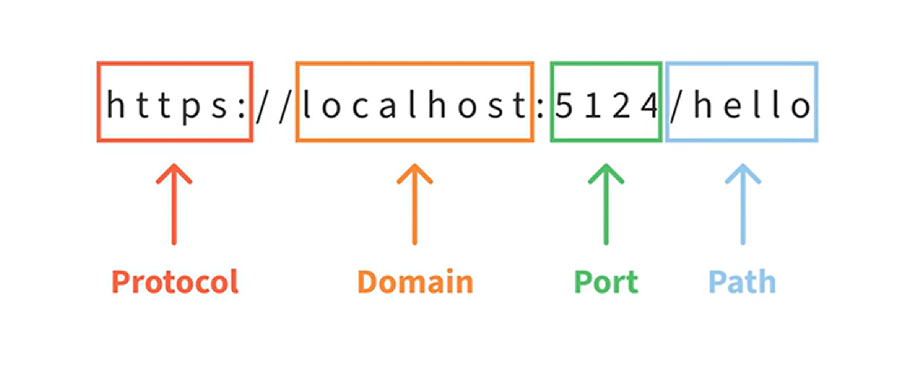
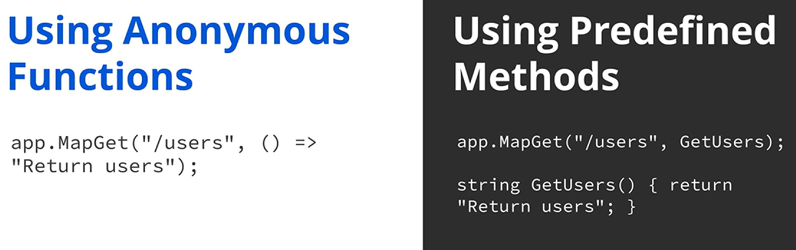

## 🧭 Routing’e Giriş

Routing, veri alma, form gönderme veya bilgi güncelleme gibi her isteğin doğru fonksiyona ulaşmasını sağlar. Routing sayesinde uygulamanız her isteği tam olarak nasıl ele alacağını bilir; böylece veri alma, form gönderimleri veya güncellemeler verimli şekilde işlenir.

Bu, kullanıcı deneyimini akıcı tutar ve her eylemin doğru şekilde yürütülmesini sağlar. Bu videoda,  *ASP.NET Core* ’da routing’i açıklayacağız. Uygulamada routing’in nasıl çalıştığını keşfederek başlayalım.

---

## 🧩 Routing Nasıl Çalışır?

Routing, bir uygulamanın gelen girdiye veya uygulama içindeki belirli bir path’e göre hangi spesifik fonksiyonun ya da action’ın çalıştırılacağını belirlemesidir.

Bir kullanıcı bir istek yaptığında; örneğin bir sayfaya gittiğinde veya bir form gönderdiğinde, router URL pattern’ine, HTTP method’una ve ek parametrelere göre hangi fonksiyonun veya controller’ın bu isteği ele alacağına karar verir.

Routing, postadaki bir adres gibidir; doğru yere ulaşmasını sağlar. Kullanıcı isteklerinin, veri getirme veya veri gönderme gibi işlemlerinin doğru fonksiyona yönlendirilmesini sağlar.

Artık routing’in ne olduğunu anladığımıza göre,  *ASP.NET Core* ’da temel route’ların nasıl tanımlandığını inceleyelim.

---

## 🛠️ ASP.NET Core’da Temel Route Tanımlama

 *ASP.NET Core* ’da routing, gelen istekleri uygun fonksiyonlara veya controller’lara eşlemek için tanımlı pattern’lere dayanır.

Bu pattern’ler, URL yapısına göre doğru action’ın tetiklenmesini sağlayarak farklı isteklerin esnek şekilde ele alınmasına imkân verir.

Genellikle route’lar `program.cs` dosyasında tanımlanır; bu da geliştiricilerin isteklerin uygulama içinde nasıl işleneceğini ve yönlendirileceğini kontrol etmesini sağlar.

---

## 🧱 `map` Metotları ile API Route Yapısı

Bir API route’unun temel yapısı, `app` üzerinde bir `map` metodu çağırarak başlar.

Bunlar; HTTP method’larına karşılık gelen `mapGet`, `mapPost`, `mapPut` ve `mapDelete` gibi metotlardır.

Şimdi `GET` metodunu ele alan bir API route örneğini inceleyelim.

`app.mapGet` çağırırız ve iki argüman veririz: bir string ve bir fonksiyon.

Şimdi `map` fonksiyonunun argümanlarını konuşalım.

---

## 🧾 `map` Fonksiyonunun Argümanları

İlk argüman, route pattern’i veya template’idir.

Bu, request URL içinde eşleşmesi gereken bir pattern belirtir. Bu örnekte `/users` pattern’ini kullanırız.

Buna bazen address, path veya slug da denir.

Bir istek bu route ile eşleştiğinde, bir fonksiyonu çağırır ve ona request’i geçirir.

---

## 🌐 URL Yapısı

Şimdi URL’leri biraz daha detaylı konuşalım.

Bir URL farklı parçalardan oluşur. Uygulamamız bilgisayarımızda çalışırken uygulamaya bir istek yaptığımız URL şu şekilde görünebilir:

`HTTPS localhost:5124/hello`

* `HTTPS` protocol’dür
* `localhost` domain’dir
* `5124` port’tur
* `hello` path’tir

Bizim pattern’imiz bu path kısmıyla eşleşmeyi hedefler.

Bir kullanıcı path’i `/users` olan bir `GET` isteği yaparsa, tanımladığımız fonksiyon çağrılır.

---

## 🧠 Handler Function ve Request Delegate

Son argüman, route eşleştiğinde çalıştırılan handler function’dır.

Bu bir route handler function örneğidir ve string gibi basit bir değer, JSON object veya başka herhangi bir response type döndürebilir.

Route handler function’lar, `request delegate` türündedir.

Request delegate, “bir isteği işleyebilen fonksiyon” demenin daha süslü bir yoludur.

Ve route handler’lar, belirli path pattern’leriyle eşleşen istekleri işleyen request delegate’lerdir.

Request delegate’lerin diğer türleri belirli route’larla sınırlı değildir; bunları middleware’i konuştuğumuzda ele alacağız.

Bu örnekte, fonksiyonumuz hiç parametre almıyor; aslında gerekirse request’i argüman olarak alıp erişebilirdi.

Fonksiyonumuz `return users` string’ini döndürüyor.

Handler olarak ya anonymous function ya da predefined method kullanabilirsiniz.

---

## 🧷 Anonymous Function ve Predefined Method

Anonymous function (lambda expression olarak da bilinir), ayrı bir isim gerektirmeyen kısa, inline bir fonksiyondur.

Şu ana kadar kullandığımız şey budur.

Response logic basitse ve ayrı bir method tanımına ihtiyaç duymuyorsa, anonymous function kullanışlı olabilir.

Anonymous function ile handler function, route içinde doğrudan tanımlanır.

Buna karşılık predefined method ile sadece handler function’ın adını yazmanız yeterlidir.

Anonymous function yerine predefined method kullanabilirsiniz.

Bu durumda lambda fonksiyonumuzu `get users` adlı bir metoda çıkarır ve lambda yerine bu metodu kullanırız.

Artık route handler’ları nasıl tanımladığımızı konuştuğumuza göre, route template’lerinden bahsedelim; static route’lar ile başlayalım.

---

## 🧱 Static Routes

Şimdiye kadar, yalnızca tek bir string ile tam eşleşen bir istekte tetiklenecek tek bir route kullandık.

Bu örnekte string `users`’tır.

Ayrıca `admin` ve `hello` gibi başka spesifik route’lar için de handler’lar oluşturabiliriz; bunun için `map get` metodunu ek çağrılarla kullanıp `admin` ve `hello` string’lerini geçeriz.

Bu handler’ların her biri tek bir route’u yönetir.

Tam path eşleşmesi gerektiren route’lar `static routes` olarak bilinir.

---

## 🧩 Route Parameters ile Dinamik Route’lar

Bazen birden fazla route’u eşleyebilen handler’lar tanımlamak kullanışlıdır.

Bunun bir yolu `route parameters` kullanmaktır.

Route parameters, web uygulamasında belirli bir route’a ID gibi veri geçirmek için kullanılan URL’nin dinamik parçalarıdır.

Şimdi `/users` route’umuzu route parameter alacak şekilde değiştirelim.

Route parameter’lar isimlendirilir ve curly brace `{}` içine alınır.

Bu durumda users route’una `/` ekleriz ve ardından `{id}` ekleriz.

`id`, parametremizin adıdır ve request delegate’e iletilir; böylece fonksiyonumuz içinde kullanabiliriz.

Sonra argüman olarak geçirilir.

Bu örnekte ona `id` deriz ve `int` type veririz.

Sonra o `id`’yi loglarız.

Bir istek `/users/5` route’una yapılırsa, `user id: 5` döndürür.

Bir istek `/users/3` yapılırsa, `user id: 3` döndürür.

`id` parametresi, bu tek route tanımının birçok farklı URL’yi ele almasını sağlar.

Bu, `dynamic route` olarak da bilinir.

---

## ❓ Optional Parameters

Veri her zaman gerekli olmadığında, optional parameters faydalı olabilir.

Bu, route’ların veri verilse de verilmese de istekleri ele almasını sağlar.

Bir parametreyi optional yapmak için route içindeki isme bir `?` eklersiniz.

Request delegate de artık optional olduğu için argüman type’ından sonra bir `?` eklemelidir.

Request delegate’i, `id` argümanına `1` varsayılan değeri vererek değiştirebiliriz.

Artık bir client `/users` isterse, `user id 1` döndürürüz.

---

## 🧱 Route Constraints

Route constraints, parametrelerin kabul edebileceği veriyi kısıtlayan kurallardır; böylece yalnızca geçerli veri geçirilmesini sağlar.

Constraints, parametrelerin belirli standartları karşılayıp karşılamadığını doğrulamak için kullanılabilir.

Biz parametre tipini, route handler argümanını `int` yaparak zorluyorduk; ama bunu daha açık şekilde `{id:int}` yazarak da yapabiliriz.

Bu route’taki constraint, ordered parameter’ın bir integer olmasını sağlayan bir kontrol uygular.

Eğer biri `/users/ABC` denerse, istek reddedilir.

`ABC` karakterleri integer’a parse edilemez; ama route handler integer beklediği için bu veri handler’a geçemez.

Constraints, doğru parametre tipini kontrol etmekten çok daha fazlasını yapabilir.

Bazı yaygın örnekler: sayıların belirli bir aralıkta olması, string’lerin belirli uzunluklarda olması ve hatta regular expressions adı verilen özel template’ler ile karmaşık pattern matching yapılmasıdır.

---

## ✅ Kapanış

Bu videoda,  *ASP.NET Core* ’da routing’in istekleri belirli fonksiyonlara nasıl eşlediğini öğrendiniz.

Artık *ASP.NET Core* uygulamalarınızda istekleri verimli şekilde ele almak için esnek ve geçerli route’lar yapılandırabilirsiniz.
