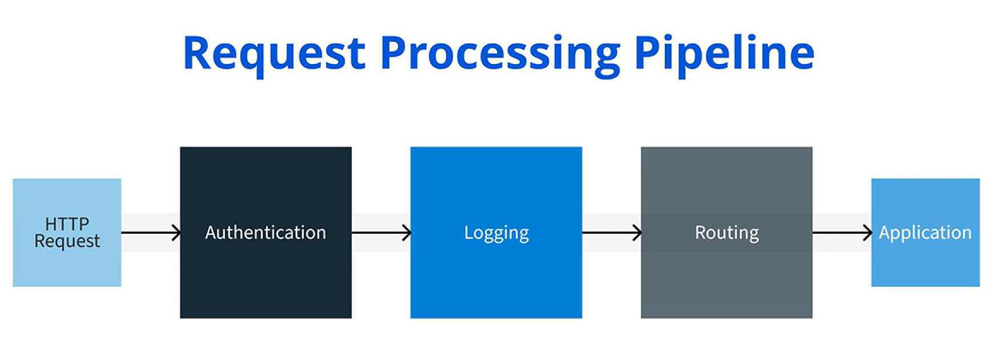
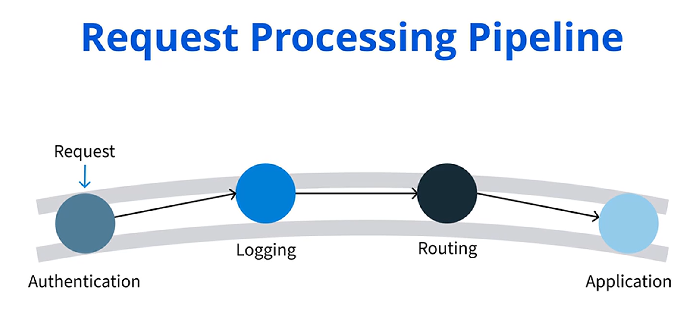

## 🧩 Concept of Middleware

Bir çevrim içi mağaza işlettiğinizi hayal edin. Birisi sipariş verdiğinde stok kontrolü yapmak, kargo ücretini hesaplamak ve ödemeyi işlemek gibi birden fazla görevin gerçekleşmesi gerekir. Peki sisteminiz tüm bu adımları nasıl yönetir? Çözüm, *middleware* dediğimiz şeyde bulunur.

Bu videoda  *middleware* ’i ve ASP.NET Core uygulamalarındaki rolünü tanımlayacağız.  *Middleware* ’in, ön yüz ( *front end* ) ile arka uç ( *back end* ) arasında çalışan bir yazılım olduğunu hatırlayın; farklı servisler, uygulamalar veya bileşenler arasında iletişimi ve veri yönetimini kolaylaştıran bir köprü görevi görür.

Devam etmeden önce,  *middleware* ’i anlamak için temel bir bileşen olan  *HTTP requests* ’i inceleyelim.

---

## 🌐 HTTP Requests

Bir  *HTTP request* , bir istemcinin (örneğin bir web tarayıcısının) sunucudan veri istemek veya bir eylem gerçekleştirmek için gönderdiği mesajdır. Bu, web tarayıcılarının ve sunucuların internet üzerinde nasıl iletişim kurduğunun temeli olan  *HTTP protocol* ’ün bir parçasıdır.

ASP.NET Core’daki  *middleware* ,  *HTTP requests* ’lerin nasıl yönetileceğini kontrol eder. Geliştiricilerin her isteği işleyen bir *pipeline* (bir dizi *middleware* adımı) kurmasına olanak tanır.

 *Pipeline* ’ı bir fabrikadaki taşıma bandı gibi düşünün. Bant üzerindeki her bir *middleware* parçası, kimlik doğrulama kontrolü yapmak veya etkinliği kaydetmek gibi bir görev gerçekleştirir ve ardından isteği bir sonraki aşamaya iletir. Örneğin, bir web sitesine giriş yaptığınızda, *middleware* güvenli bölümlere erişmenize izin vermeden önce kimlik bilgilerinizi kontrol eder.

---

## 🔗 Middleware Bileşenleri Uygulamada Nasıl Birlikte Çalışır?

Artık  *middleware* ’i anladığımıza göre, *middleware* bileşenlerinin bir uygulama içinde nasıl birlikte çalıştığını inceleyelim.

*Middleware components* bir sırayla çalışır; bayrak yarışındaki koşucular gibi. Her bileşen kendi görevini yapar ve ardından isteği bir sonraki *middleware* parçasına iletir.

Örneğin bir web sayfasını ziyaret ettiğinizde:

* İlk *middleware* ziyaretinizi kaydeder; buna *logging* denir. *Logging* önemlidir çünkü sayfaya kimin ne zaman eriştiğini takip eder.
* Bir sonraki *middleware* oturum açıp açmadığınızı kontrol eder; buna *authentication* denir.
* Son olarak başka bir *middleware* veriyi (örneğin sayfa içeriğini) getirir ve size bir *response* olarak geri gönderir; bu sürece *data retrieval* denir.

---

## 🧰 Yerleşik ASP.NET Core Middleware Bileşenleri

Şimdi, yaygın uygulama görevlerini ele alan bazı yerleşik ASP.NET Core *middleware* bileşenlerini inceleyelim.

ASP.NET Core web framework’ü, belirli görevleri yönetmeyi basitleştiren birden fazla yerleşik *middleware component* ile gelir.

Bunlardan biri **`UseAuthentication`** olarak adlandırılır.  **`UseAuthentication`** , bir kullanıcının web sitesinin belirli bölümlerine erişmesine izin vermeden önce oturum açıp açmadığını doğrular. Bu, hassas kullanıcı verilerini korumak için kritiktir; örneğin bir bankacılık uygulamasında, hesap bilgilerinizi yalnızca güvenli şekilde giriş yaptıktan sonra görüntülemenizi sağlar.

Bir diğer *middleware component* ise  **`UseRouting`** ’dir. Bu, gelen istekleri URL’ye göre uygulamanın doğru bölümüne eşler.

Ayrıca, kullanıcıyı doğru *controller* ve  *action method* ’a yönlendirmeye yardımcı olur; bir GPS gibi, girilen bilgiye göre sürücüyü doğru hedefe yönlendirir.

---

## ✅ Özet

 *Middleware* , ASP.NET Core’da istekleri ve yanıtları yönetmek için gereklidir.  *Logging* , *authentication* ve *data retrieval* gibi her adımın doğru şekilde yönetilmesini sağlar; böylece uygulamanız güvenli ve verimli kalır.

Bu videoda *middleware* hakkında bilgi edindiniz ve ASP.NET Core uygulamalarındaki rolünü tartıştınız. *Middleware* kullanarak modüler, esnek ve sürdürülebilir ASP.NET Core uygulamaları oluşturabilirsiniz.
