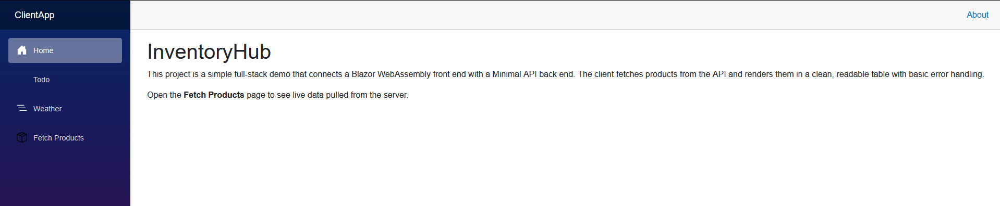
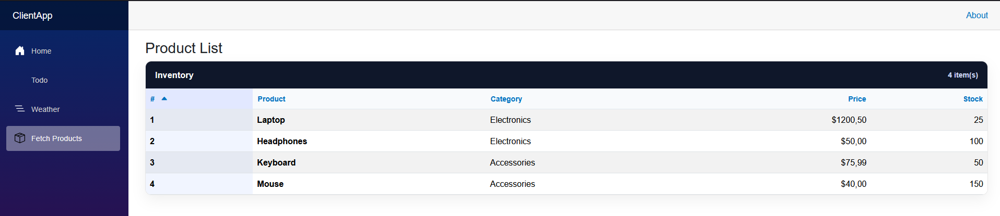
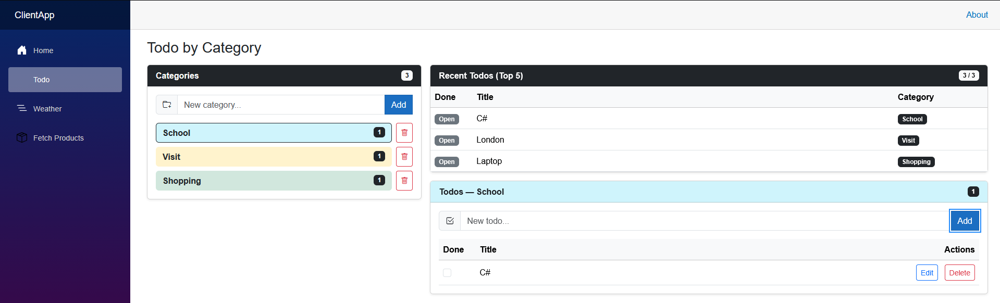
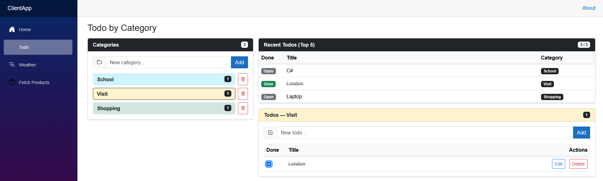
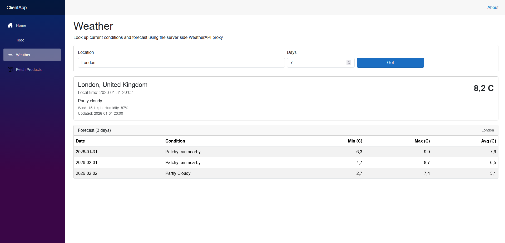

# InventoryHub

InventoryHub is a full-stack demo application built with:

- **Front-end:** Blazor WebAssembly (ClientApp) running on `http://localhost:5181`
- **Back-end:** ASP.NET Core Minimal API + Controllers (ServerApp) running on `http://localhost:5159`

The project demonstrates front-end/back-end integration, debugging typical integration issues (routes/CORS/JSON), structured JSON responses, and performance-minded patterns (caching + reduced redundant calls). It also includes WeatherAPI.com integration (API key stored server-side) and a Todo module with categories.



---

## Features

### Products (Inventory)

- Fetch products from the back-end endpoint: `GET /api/productlist`
- Display products in a Bootstrap table
- **Sorting** by Id, Product, Category, Price, Stock (with Bootstrap Icons indicators)
- **Category column** (nested JSON object)
- Optional search/filter by product name (if enabled in your version)

### Weather (WeatherAPI.com)

- Back-end calls WeatherAPI.com and returns sanitized responses to the front-end
- Front-end can switch between:
  - **Realtime API**
  - **Forecast API**
  - **History API**
- API key is never exposed to the browser (stored in `.env`)

### Todo (Categories → Todos)

- Create categories first, then create todos under a category
- A category can contain multiple todos
- Mark todos as done, edit, delete
- Category deletion is supported (blocked if category has todos)
- Recent view: **Top 5 todos shown by default**, full list shown after selecting a category
- Client-side validation:
  - HTML `required`
  - JavaScript validation blocks empty/whitespace submissions

---

## Project Structure

- `ClientApp/` — Blazor WebAssembly front-end
- `ServerApp/` — ASP.NET Core back-end (Minimal API + Controllers)
- `REFLECTION.md` — Reflection on how Microsoft Copilot assisted across activities

---

## Prerequisites

- .NET SDK (8.x recommended)
- Node is **not** required
- Optional: Postman for API testing

---

## Configuration (.env)

Create a `.env` file (recommended at the repo root or inside `ServerApp/`) and add:

```env
WEATHER_API_BASE_URL=http://api.weatherapi.com/v1/
WEATHER_API_KEY=YOUR_API_KEY_HERE
```

**Important:** Do not commit `.env` to GitHub.

Add this to `.gitignore`:

```gitignore
.env
```

---

## Running the Application (Separate Front-end and Back-end)

### 1) Start the Back-end (ServerApp)

```bash
cd ServerApp
dotnet run
```

Back-end should be available at:

* `http://localhost:5159`

### 2) Start the Front-end (ClientApp)

```bash
cd ClientApp
dotnet run
```

Front-end should be available at:

* `http://localhost:5181`

---

## CORS (Required for separate ports)

Because Client and Server run on different ports, the Server enables CORS for:

* `http://localhost:5181`

This allows the front-end to call the back-end APIs without browser CORS errors.

---

## Main Pages (Front-end)

* Home: `http://localhost:5181/`
* Todo: `http://localhost:5181/todo`
* Weather: `http://localhost:5181/weather`
* Fetch Products: `http://localhost:5181/fetchproducts`

---

## API Endpoints (Back-end)

### Products

* `GET http://localhost:5159/api/productlist`

Expected JSON fields:

* `id`, `name`, `price`, `stock`, `category { id, name }`



### Todo Categories

* `GET http://localhost:5159/api/todo-categories`
* `POST http://localhost:5159/api/todo-categories`
* `DELETE http://localhost:5159/api/todo-categories/{id}`
  Returns **409 Conflict** if the category contains todos.





### Todos

* `GET http://localhost:5159/api/todos`
* `GET http://localhost:5159/api/todos?categoryId={id}`
* `POST http://localhost:5159/api/todos`
* `PUT http://localhost:5159/api/todos/{id}`
* `DELETE http://localhost:5159/api/todos/{id}`

### Weather (Server-side proxy)

* `GET http://localhost:5159/api/weather/current?q=London`
* `GET http://localhost:5159/api/weather/forecast?q=London&days=7`
* `GET http://localhost:5159/api/weather/history?q=London&dt=2022-01-01`



---

## Notes on Performance

* Front-end avoids unnecessary full page reloads; updates are rendered dynamically after API calls.
* Back-end can apply caching (e.g., IMemoryCache) for Weather responses to reduce external API calls.

---

## Reflection

See `REFLECTION.md` for a detailed summary of how Microsoft Copilot helped with:

* generating integration code
* debugging route/CORS/JSON issues
* structuring JSON responses (including nested objects)
* improving performance via refactoring and caching
